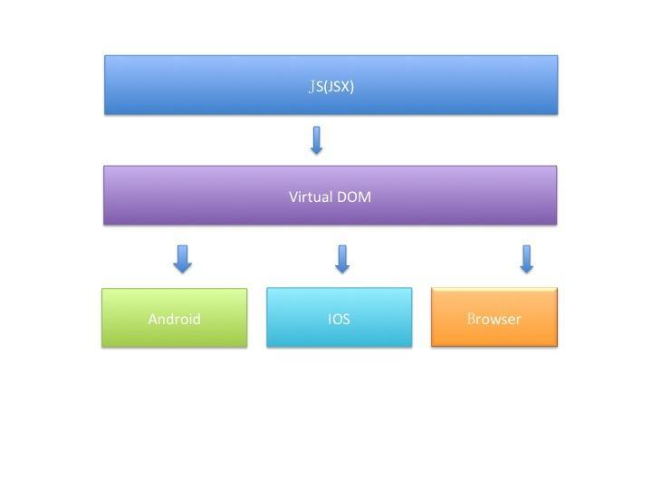

## 概念

RN 这套框架让 JS开发者可以大部分使用JS代码就可以构建一个跨平台APP。 Facebook官方说法是learn once, run everywhere， 即在Android 、 IOS、 Browser各个平台，程序画UI和写逻辑的方式都大致相同。因为JS 可以动态加载，从而理论上可以做到write once, run everywhere， 当然要做额外的适配处理。如图：



RN需要一个JS的运行环境， 在IOS上直接使用内置的javascriptcore， 在Android 则使用webkit.org官方开源的jsc.so。 此外还集成了其他开源组件，如fresco图片组件，okhttp网络组件等。

RN 会把应用的JS代码（包括依赖的framework）编译成一个js文件（一般命名为index.android.bundle), RN的整体框架目标就是为了解释运行这个js 脚本文件：

- 如果是js 扩展的API， 则直接通过bridge调用native方法; 
- 如果是UI界面， 则映射到virtual DOM这个虚拟的JS数据结构中，通过bridge 传递到native ， 然后根据数据属性设置各个对应的真实native的View。

bridge是一种JS 和 JAVA代码通信的机制， 用bridge函数传入对方module 和 method即可得到异步回调的结果。

对于JS开发者来说， 画UI只需要画到virtual DOM 中，不需要特别关心具体的平台, 还是原来的单线程开发，还是原来HTML 组装UI（JSX），还是原来的样式模型（部分兼容 )。RN的界面处理除了实现View 增删改查的接口之外，还自定义一套样式表达CSSLayout，这套CSSLayout也是跨平台实现。 RN 拥有画UI的跨平台能力，主要是加入Virtual DOM编程模型，该方法一方面可以照顾到JS开发者在html DOM的部分传承， 让JS 开发者可以用类似DOM编程模型就可以开发原生APP ， 另一方面则可以让Virtual DOM适配实现到各个平台，实现跨平台的能力，并且为未来增加更多的想象空间， 比如react-cavas, react-openGL。而实际上react-native也是从react-js演变而来。

对于 Android 开发者来说， RN是一个普通的安卓程序加上一堆事件响应， 事件来源主要是JS的命令。主要有二个线程，UI main thread, JS thread。 UI thread创建一个APP的事件循环后，就挂在looper等待事件 , 事件驱动各自的对象执行命令。 JS thread 运行的脚本相当于底层数据采集器， 不断上传数据，转化成UI 事件， 通过bridge转发到UI thread, 从而改变真实的View。 后面再深一层发现， UI main thread 跟 JS thread更像是CS 模型，JS thread更像服务端， UI main thread是客户端， UI main thread 不断询问JS thread并且请求数据，如果数据有变，则更新UI界面。

注：

Weex原理与RN相似，主要区别是前端的编写由React语法转为VUE语法

## JSBridge

双向通信的通道:
JS 向 Native 发送消息: 调用相关功能、通知 Native 当前 JS 的相关状态等。
Native 向 JS 发送消息: 回溯调用结果、消息推送、通知 JS 当前 Native 的状态等。


### 实现原理

JavaScript 是运行在一个单独的 JS Context 中（例如，WebView 的 Webkit 引擎、JSCore）。由于这些 Context 与原生运行环境的天然隔离，我们可以将这种情况与 RPC（Remote Procedure Call，远程过程调用）通信进行类比，将 Native 与 JavaScript 的每次互相调用看做一次 RPC 调用。

在 JSBridge 的设计中，可以把前端看做 RPC 的客户端，把 Native 端看做 RPC 的服务器端，从而 JSBridge 要实现的主要逻辑就出现了：通信调用（Native 与 JS 通信） 和句柄解析调用。

### 1. JavaScript 调用 Native 的方式
注入 API 方式的主要原理是，通过 WebView 提供的接口，向 JavaScript 的 Context（window）中注入对象或者方法，让 JavaScript 调用时，直接执行相应的 Native 代码逻辑，达到 JavaScript 调用 Native 的目的。

主要有两种：注入API 和 拦截URL SCHEME。

#### 1.1 注入API
##### Web实现
1. Native端实现原生方法
```java
class NativeBridge{
    private Context context;

    NativeBridge(Context context){
        this.context = context;
    }

    @JavascriptInterface
    public void showNativeDialog(String text){
        Toast.makeText(context,text,Toast.LENGTH_LONG).show();
    }
}
```

2. Native端通过WebView的接口注入JS对象
```java
webView.addJavascriptInterface(new NativeBridge(mContext),"NativeBridge");
```

3. Web中获取JS对象，调用Native代码：
```js
window.NativeBridge.showNativeDialog(text);
```

##### RN实现
1. Native端实现原生方法
```java
public class ToastModule extends ReactContextBaseJavaModule {
  private static ReactApplicationContext reactContext;
  
  // 定义模块名称
  @Override
  public String getName() {
    return "ToastExample";
  }
  
  // 定义方法
  @ReactMethod
  public void show(String message, int duration) {
    Toast.makeText(getReactApplicationContext(), message, duration).show();
  }
}
```

2. Native端在ReactPackage中注入JS对象
```java
  @Override
  public List<NativeModule> createNativeModules(
                              ReactApplicationContext reactContext) {
    List<NativeModule> modules = new ArrayList<>();

    modules.add(new ToastModule(reactContext));

    return modules;
  }
```

3. RN端获取JS对象，调用Native代码
```js
import { NativeModules } from "react-native";

NativeModules.ToastExample.show(text,duration);
```

#### 1.2 拦截URL

URL SCHEME 是一种类似于url的链接，是为了方便app直接互相调用设计的，形式和普通的 url 近似，主要区别是 protocol 和 host 一般是自定义的。
```js
<protocol>://<domain>/<path>?<query>
```
拦截 URL SCHEME 的主要流程是：Web 端通过某种方式发送 URL Scheme 请求，之后 Native 拦截到请求并根据 URL SCHEME（包括所带的参数）进行相关操作。

URL拦截，通过WebViewClient的shouldOverrideUrlLoading方法，拦截js代码执行，例如： 
```js
document.location='js://webview?name=root&pwd=1234'
```
根据scheme（协议格式）和authority（协议名），获取name和pwd。Js可以触发WebviewClient的shouldOverrideUrlLoading方法有：1，document.loacation;  2,href;  3,window.open;4,iframe.src。

#### 1.3 拦截方法

JS中执行对话框alert（警告框），prompt（提示框），confirm（确认框），console.log方法，可以触发WebChromClinet的onJsAlert，onJsPrompt，onJsConfirm，onConsoleMessage的回调。alert会弹出对话框， confirm确定对 话框，console是用来debug javascript代码的，一般prompt使用的频率比较小，使用prompt来进行js调用java

1. JS端URL请求
```js
window.alert('jsbridge://showToast?text=' + text);
```

2. Native端实现监听
```java
    webView.setWebChromeClient(new WebChromeClient() {
        @Override
        public boolean onJsAlert(WebView view, String url, String message, JsResult result) {
            if (!message.startsWith("jsbridge://")) {
                return super.onJsAlert(view, url, message, result);
            }

            UrlSchema urlschema = new UrlSchema(message);
            if ("showToast".equals(urlchema.getMethodName())) {
                String text = urlschema.getParams("text");
                Toast.makeText(mContext, text, Toast.LENGTH_LONG).show();
            }

            result.confirm();
            return true;
        }
    }
```


### 2. Native 调用 JavaScript 的方式

Native 调用 JavaScript 较为简单，直接执行拼接好的 JavaScript 代码即可，相当于在html页面中加载了一个本地js文件

#### Android

```java
// 1.loadUrl
webview.loadUrl("javascript:alert('hello world')")
  
// 2.evaluateJavascript
// 区别是：1，它可以获取调用的js函数的返回值；2，在android4.4以及上才可以使用
webview.evaluateJavascript(“javascript:alert(‘hello world’)”, new ValueCallback<String>(){
  @Override
  public void onReceiveValue(String value){
    System.out.println("js函数返回值：" + value);
  }
})
```


#### IOS

```objc
result = [uiWebview stringByEvaluatingJavaScriptFromString:"javascript:alert('hello world')"];
```


## 动画

### Animated原理
在RN中创建动画一般使用Animated组件，定义动画组件，定义动画属性，然后使用Animated提供的几种方法让动画生成。

#### JS端驱动
JS端：动画驱动在每一帧上执行requestanimationframe方法，更新value，驱动不断的使用新的value计算动画视图。
JS端：计算差值，并且传递给绑定的view
JS端：使用setNativeProps来更新View
JS到原生桥接
原生端：View更新
所以可以看到，大多数工作都在JS端，如果JS端被阻塞，动画将会跳帧，并且每帧都需要JS传递到原生端去更新。

#### 原生端驱动
而使用RN提供给动画的原生驱动方式，则可以将上面所有步骤都移交至native端，当Animated组件产生动画节点图之后，在动画开始时，可以进行序列化，并传递到native直接执行，这样就省去了向JS端callback的过程，而原生端只关心在UI线程的每一帧，并直接更新。

基于此，使用原生驱动的动画流程将变为： 
1. 原生端：原生动画驱动使用CADisplayLink或者android.view.Choreographer去执行每一帧，计算并更新动画视图得到的新值。 
2. 原生端：差值计算并被传递给绑定的原生view 
3. 原生端：UIView或者android.view更新 
如此，没有更多的JS线程，没有更多的桥接，也就意味着更快的动画效果。

#### useNativeDriver使用原生驱动
在Animated动画config设定中，添加useNativeDriver字段，并设为true
##### 注：
- 只能使用非布局的属性，比如transform或者opacity可以，而flexbox和位置属性不行
- Animated.event只能工作于直接的事件而不是冒泡事件，比如PanResponder不能使用但是scrollView的onScroll方法可以

比如：实现一个拖拽一个圆点，其余圆点逐渐跟随被拖拽圆点的动画；
非原生驱动，其余圆点会跟着拖拽圆点走，但是掉帧；
原生驱动，不会掉帧，但是需要在手势释放后，其余圆点动画才会跟随被拖拽圆点（原因：原生Brige & JS单线程）。

### Animation源码初探

以**Animated.timing()**为例
`react-native/Libraries/Animated/src/animations/TimingAnimation.js`

#### start
- 若duration为0，且非原生驱动，直接调用更新回调，结束动画
- 否则根据原生驱动接口，分别实现原生动画，或者使用`requestAnimationFrame`实现帧动画，帧动画可以调用this.onUpdate回调动画值
```js
start(
    fromValue: number,
    onUpdate: (value: number) => void,
    onEnd: ?EndCallback,
    previousAnimation: ?Animation,
    animatedValue: AnimatedValue,
  ): void {
    this.__active = true;
    this._fromValue = fromValue;
    this._onUpdate = onUpdate;
    this.__onEnd = onEnd;

    const start = () => {
      // Animations that sometimes have 0 duration and sometimes do not
      // still need to use the native driver when duration is 0 so as to
      // not cause intermixed JS and native animations.
      if (this._duration === 0 && !this._useNativeDriver) {
        this._onUpdate(this._toValue);
        this.__debouncedOnEnd({finished: true});
      } else {
        this._startTime = Date.now();
        if (this._useNativeDriver) {
          this.__startNativeAnimation(animatedValue);
        } else {
          this._animationFrame = requestAnimationFrame(
            this.onUpdate.bind(this),
          );
        }
      }
    };
    if (this._delay) {
      this._timeout = setTimeout(start, this._delay);
    } else {
      start();
    }
  }
```
#### update
在开始时间到duration结束时间内，回调动画值
```js
  onUpdate(): void {
    const now = Date.now();
    if (now >= this._startTime + this._duration) {
      if (this._duration === 0) {
        this._onUpdate(this._toValue);
      } else {
        this._onUpdate(
          this._fromValue + this._easing(1) * (this._toValue - this._fromValue),
        );
      }
      this.__debouncedOnEnd({finished: true});
      return;
    }

    this._onUpdate(
      this._fromValue +
        this._easing((now - this._startTime) / this._duration) *
          (this._toValue - this._fromValue),
    );
    if (this.__active) {
      this._animationFrame = requestAnimationFrame(this.onUpdate.bind(this));
    }
  }
```
#### stop
清除定时器，结束动画
```js
  stop(): void {
    super.stop();
    this.__active = false;
    clearTimeout(this._timeout);
    global.cancelAnimationFrame(this._animationFrame);
    this.__debouncedOnEnd({finished: false});
  }
```

### 一维动画 Animated.Value
声明一维动画标量值
```js
const _value = new Animated.Value(0);
```
#### setValue
设置动画值
```js
_value.setValue(100);
```
#### setOffset
设置偏移量，动画值变动计算仍不变，结果会加上偏移量
```js
_value.setOffset(100);
```
#### flattenOffset
合并偏移量到动画值，并将偏移量设为0
```js
//_value值合并偏移量100
_value.setOffset(100);
_value.flattenOffset();
//即等于
_value.setOffset(100);
_value.setOffset(0);
_value.setValue(100);
```
#### extractOffset
将偏移量设置为动画当前值，并将动画值设为0
```js
//_value值动画变动到了100
_value.setValue(100);
_value.extractOffset();
//即等于
_value.setValue(100);
_value.setOffset(100);
_value.setValue(0);
```
#### addListener
监听动画值，Animated.Value是无法直接取值的，做判断等条件时需要取值
```js
_value.addListener(state=>{
	//读取 _value 的值
	console.log(state.value)
})
```
#### interpolate
插值函数
```js
_value.interpolate({
	inputRange:Array,//动画变化值
	outputRange:Array,//映射输出变化值
	...
})
```

### 二维动画 Animated.ValueXY
二维动画标量值
#### getLayout()
将动画值赋值{x, y}到样式style的{left, top}属性中
```js
style={this.state.anim.getLayout()}
```
#### getTranslateTransform()#
getTranslateTransform();
将动画值赋值{x, y}到样式style.transform.translation属性中（即{translateX,translateY}）
```js
style={{
  transform: this.state.anim.getTranslateTransform()
}}
```

### 视图布局动画 LayoutAnimation
视图布局动画
当页面Dom布局变化时，自动将视图运动到它们新的位置上。
一个常用的调用此 API 的办法是在状态更新前调用，注意如果要在Android上使用此动画，则需要在代码中启用：

```js
import { UIManager } from 'react-native';

//这段代码应该写在任何组件加载之前，比如可以写到 index.js 的开头
if (Platform.OS === 'android') {
  if (UIManager.setLayoutAnimationEnabledExperimental) {
    UIManager.setLayoutAnimationEnabledExperimental(true);
  }
}
```
#### configureNext()
计划下一次布局要发生的动画
```js
static configureNext(config, onAnimationDidEnd?, onAnimationDidFail?)
```
##### config
- duration 动画持续时间，单位是毫秒。
- create，配置创建新视图时的动画。（参阅Anim类型）
- update，配置被更新的视图的动画。（参阅Anim类型）
- delete，配置被移除的视图的动画。（参阅Anim类型）
配置详见[官网文档](https://reactnative.cn/docs/layoutanimation#spring)
##### 例
```jsx
const App = () => {
  const [expanded, setExpanded] = useState(false);

  return (
    <View style={style.container}>
      <TouchableOpacity
        onPress={() => {
          LayoutAnimation.configureNext(LayoutAnimation.Presets.spring);
          setExpanded(!expanded);
        }}
      >
        <Text>Press me to {expanded ? "collapse" : "expand"}!</Text>
      </TouchableOpacity>
      {expanded && (
        <View style={style.tile}>
          <Text>I disappear sometimes!</Text>
        </View>
      )}
    </View>
  );
};
```
#### create()
用来创建configureNext所需的 config 参数的辅助函数。
```js
static create(duration, type, creationProp)
```
##### 例
```js
  const toggleBox = () => {
    LayoutAnimation.configureNext(
      LayoutAnimation.create(
        500,
        LayoutAnimation.Types.spring,
        LayoutAnimation.Properties.scaleXY
      )
    );
    setExpanded(!expanded);
  };
```


## 官方方法

### DeviceEventEmitter
react-native中自定义事件监听时使用插件DeviceEventEmitter实现

注册通知：
```js
import  { DeviceEventEmitter } from 'react-native';
//…
//调用事件通知
DeviceEventEmitter.emit('xxxName’,param);
//xxxName:通知的名称 param：发送的消息（传参）
```
接收通知：
```js
//开始监听
componentDidMount(){
    /**
    * @xxxName :事件名称
    * @param：事件参数
    */
	this.listener = DeviceEventEmitter.addListener('xxxName',(param)=>{ });
}

//移除监听
componentWillUnmount(){
      this.listener.remove();
  }

```

# Metro打包

metro 是一个针对 React Native的JavaScript模块打包器，他接收一个entry file (入口文件) 和一些配置作为参数，返回给你一个单独的JavaScript文件，这个文件包含了你写的所有的JavaScript 代码和所有的依赖。

也就是说Metro把你写的几十上百个js文件和几百个node_modules的依赖，打包成了一个文件。

## Metro工作原理

Metro 的打包过程有3个独立的阶段
- Resolution
- Transformation
- Serialization

### Resolution 阶段

Metro 需要建立一个你的入口文件所需要的所有的模块的表，为了找到一个文件依赖了哪些文件，Metro 使用了一个resolver。在实际中，Resolution阶段是和transformation阶段并行进行的。

### Transformation阶段

所有的模块都要经历一个 transformer， transformer 负责把一个模块转换成RN能理解的格式；

### Serialization阶段

一旦模块被转换完成，就会马上被serialized，通过serializer，把上一个阶段转换好的模块组合成一个或多个bundle，bundle 就是字面意思：把一堆模块组合成一个单独的JavaScript文件

Metro这个库已经根据bundle时的各个阶段，拆分为resolver,transformer,serializer 模块了，每个模块负责相应的功能，因此你可以方便的替换为自己的模块。

## Metro工作流程
执行bundle命令，指定资源入口
-> 定义系统模块（_d，require函数）（Resolution阶段） 
-> 模块拆包 
-> 去重过滤 
-> 代码转化（Transformation阶段）
-> 模块合并 （Serialization阶段）
-> 输出bundle

bundle中使用Number(int)数值型以_d的方式定义了代码模块ID，并使用_r的方式进行依赖行。如果存在模块间的改变或者修改，都有可能导致模块ID发生改变，导致旧的bundle文件不能使用。所以在拆分公共部分与业务部分的过程中，需要我们解决模块间依赖的问题。

- _d：define (简单理解为模块)包括RN框架源码 js 部分、自定义js代码部分、图片资源信息，供 require 引入使用
- _r：require 找到 __d 定义的代码块 并执行

### 打包配置
- entry-file	根JS文件的绝对路径

- output	文件名存储输出的位置，例如 /tmp/dependencies.txt

- platform	用于选择模块的平台扩展

- transformer	指定要使用的自定义转换器

- max-workers	指定工作池将为转换文件生成的最大工作器数。默认为计算机上可用的核心数。

- dev	如果为false，则跳过所有dev-only代码路径

- verbose	启用日志记录

- config  打包配置脚本

  例：
```sh
echo  "Starting to make jsbundle..."
METRO_ROOT_DIR=$ROOT_DIR \
node "$ROOT_DIR/node_modules/react-native/local-cli/cli.js" bundle \
--dev false \
--entry-file $ROOT_DIR/$INPUT_JSBUNDLE \
--platform android \
--bundle-output  $OUTPUT_JSBUNDLE \
--sourcemap-output $OUTPUT_SOURCEMAP \
--assets-dest $OUTPUT_DIR \
--reset-cache true \
--config "$ROOT_DIR/bundle-script.js"
echo "finished."
```

配置打包config脚本`$ROOT_DIR/bundle-script.js`

```js
//根据打包阶段周期的钩子函数，实现打包时需要的脚本
module.exports = {
    serializer: {
        createModuleIdFactory: createModuleIdFactory,
        processModuleFilter: postProcessModulesFilter
        /* serializer options */
    },
    projectRoot: rootDir
};
```

### 拆包实践
- 根据 **bundle中使用Number(int)数值型以_d的方式定义的代码模块ID** 打包common包，并结合模块本地路径生成模块配置表
- 根据common包模块配置表，整合Diff包模块并打包

#### common包
Metro配置打包时执行`$ROOT_DIR/comm-bundle-script.js`脚本
```js
module.exports = {
    serializer: {
    		//实现钩子函数，根据模块ID和模块本地路径写入模块配置表
        createModuleIdFactory:createModuleIdFactory
    }
};
```
模块配置表
```json
{
  "id": 0,
  "path": "node_modules/react/index.js"
},
{
  "id": 1,
  "path": "node_modules/react/cjs/react.production.min.js"
},
...
```

#### diff包
Metro配置打包时执行`$ROOT_DIR/diff-bundle-script.js`脚本
```js
module.exports = {
    serializer: {
        //实现钩子函数，根据模块配置表过滤掉common包模块
        processModuleFilter: postProcessModulesFilter
    },
    projectRoot: rootDir
};
```

#### 整合
初始化RN环境时就加载基础包，后续添加模块功能时只需要添加模块功能的diff包即可，在任更新的应用是，在需要热更新时，下载最新diff包去替换原先diff包，重新启动后应用最新diff包即可
注：
- common包需要向前兼容

#### 为什么要使用路径代替moudleId进行引用
metro-bundler 打包处理模块时，以递增的方式给每个模块一个 module ID，使得文件直接通过 require(module ID) 的方式引用其他模块；当然，一个项目的所有模块都在一个 bundle 中是没问题的，但进行 bundle 拆分后，当框架新增或删除一个依赖时，因为模块编号的方式使得在该状况下，后续的模块的 module ID 将会错位，这将造成升级框架 bundle 的难度，每次升级，其他业务 bundle 相应的需要回归测试，加大了开发测试成本。

##### 注：
因为使用路径表示，将会出现模块配置表在Mac和Win不一致的情况（因系统的相对路径表示的差异），将会导致Mac系统的common包配置表在Win系统下无效等情况（系统反之亦然）


# 常见错误

## 运行报错

#### error Invalid regular expression: /(.*\\__fixtures__\\.*|node_modules[\\\]react[\\\]dist[\\\].*|webs
windows 电脑 执行 react-native 项目，报错如下：
```sh
error Invalid regular expression: 
/(.*\\__fixtures__\\.*|node_modules[\\\]react[\\\]dist[\\\].*|website\\node_modules\\.
*|heapCapture\\bundle\.js|.*\\__tests__\\.*)$/:
 Unterminated character class. Run CLI with --verbose flag for more details.
```
##### 解决方法 ：

找到这个文件：

```sh
\node_modules\metro-config\src\defaults\blacklist.js
```

替换内容为：

```js
var sharedBlacklist = [
  /node_modules[\/\\]react[\/\\]dist[\/\\].*/,
  /website\/node_modules\/.*/,
  /heapCapture\/bundle\.js/,
  /.*\/__tests__\/.*/
];
```
原来以为这个报错是因为 windows 系统导致的，所以要对内容进行转义，后来发现其他同事windows系统并未有此现象，个人分析原因可能是命令工具所致