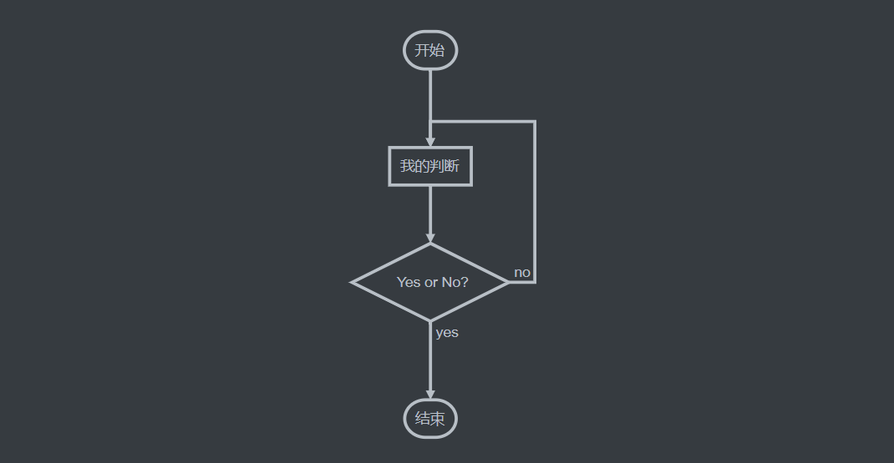

# MarkDown基础语法
Markdown是一种纯文本格式的标记语言。通过简单的标记语法，它可以使普通文本内容具有一定的格式。

## 目录
#### [一、标题](##一、标题)
#### [二、字体](##二、字体)
#### [三、引用](##三、引用)
#### [四、分割线](##四、分割线)
#### [五、链接](##五、链接)
#### [六、图片](##六、图片)
#### [七、列表](##七、列表)
#### [八、表格](##八、表格)
#### [九、代码](##九、代码)
#### [十、流程图](##十、流程图)


## 一、标题
在想要设置为标题的文字前面加#来表示
- 一个#是一级标题，二个#是二级标题，以此类推
- 支持六级标题
- #后面需要加空格
### 示例：
```markdown
### 这是三级标题
#### 这是四级标题
##### 这是五级标题
###### 这是六级标题
```

### 效果：
### 这是三级标题
#### 这是四级标题
##### 这是五级标题
###### 这是六级标题

## 二、字体

### 示例：
```markdown
**这是加粗的文字**

*这是倾斜的文字*`

***这是斜体加粗的文字***

~~这是加删除线的文字~~
```
### 效果：
**这是加粗的文字**

*这是倾斜的文字*`

***这是斜体加粗的文字***

~~这是加删除线的文字~~

## 三、引用
在引用的文字前加>即可，引用也可以嵌套，如加两个>>三个>>>
n个...
### 示例：
```markdown
>这是引用的内容
>>这是引用的内容
>>>这是引用的内容
```
### 效果：
>这是引用的内容
>>这是引用的内容
>>
>>>这是引用的内容

## 四、分割线
三个或者三个以上的 - 或者 * 都可以。
### 示例：
```markdown
---
----
***
*****
```
### 效果：
---
----
***
*****

## 五、链接
### 语法：
```markdown
//1.默认使用方式
[超链接名](超链接地址 "超链接title")

//2.也可以直接使用a标签
<a href="spdb.com.cn" target="_blank">浦发银行</a>
```
注：
- 这里的链接地址也可以是本文目录锚点如`[五、链接](##五、链接)` 
- title可以省略
### 示例：
```markdown
[浦发银行](http://spdb.com.cn)
[五、链接](##五、链接)
```
### 效果：
[浦发银行](http://spdb.com.cn)
[五、链接](##五、链接)


## 六、图片
图片实际上只是链接的一个变种，只是将跳转链接替换为图片地址，区别之处在于语法前多加了一个`!`符号
### 语法：
```markdown
//1.默认使用方式


//2.需要其他图片属性也可直接使用img标签

```
- 图片alt就是显示在图片下面的文字，相当于对图片内容的解释。
- 图片title是图片的标题，当鼠标移到图片上时显示的内容，title可加可不加。
### 示例1：
```

```
### 效果1：

### 示例2：
```

```
### 效果2：


## 七、列表
### 语法：
- 无序列表用 - + * 任何一种都可以
- 有序列表用 数字加点
- 序号跟内容之间要有空格
- 多级列表加Tab
```markdown
- 列表内容
  - 二级列表
    - 三级列表
+ 列表内容
* 列表内容
```

```markdown
1. 列表内容
2. 列表内容
3. 列表内容
```
### 示例：
- 列表内容
  - 二级列表
    - 三级列表
+ 列表内容
* 列表内容

1. 列表内容
2. 列表内容
3. 列表内容

## 八、表格
### 语法：
```markdown
表头|表头|表头
---|:--:|---:
内容|内容|内容
内容|内容|内容
```
- 第二行分割表头和内容，
- `-`有一个就行，为了对齐建议多加了几个
- 文字默认居左，`-`两边加：表示文字居中，`-`右边加：表示文字居右
- 原生的语法两边都要用 `|` 包起来，部分阅览器（VSCODE/GITHUB）可以省略

### 示例：
|表头|表头|表头|
|---|:--:|---:|
|内容|内容|内容|
|内容|内容|内容|

## 九、代码
### 语法：
- 单行代码：一对反引号（位于键盘上的`~`符号键）
- 代码块：代码之间分别用三个反引号包起来，且两边的反引号单独占一行，在第一行(```)后可以加语言(`js`,`java`,`python`等)，控制代码高亮
- 注：为了防止阅读器转译，前后三个反引号处加了小括号，实际需要去掉两边小括号
```
//单行代码
`npm start`

//代码块
(```js)
created(){
  for (let index = 0; index < array.length; index++) {
    const element = array[index];
    console.log(element);
  }
}
(```)
```
### 示例：
- 单行代码:
`npm start`
- 代码块:
```js
created(){
  for (let index = 0; index < array.length; index++) {
    const element = array[index];
    console.log(element);
  }
}
```


## 十、流程图
流程图作为代码块的一个变种，实际上具体内容也是代码；并且由于部分阅读器也不支持，所以用的较少，并且需要用到的流程图地方常常会用图片替代
### 语法
```
(```flow)
  流程图
(```)
```

#### 流程图元素定义语法:
```
tag=>type: content:>url
```
- tag：声明元素名称
- type：声明元素类型
- content：元素显示文本内容（空格隔开）
- url：点击跳转的超链接

注：元素类型type一共有6种
|type|功能|
|---|---|
|start |开始|
|end |结束|
|operation  |操作|
|subroutine |子程序|
|condition  |条件判断|
|inputoutput|输入输出|

#### 流程图元素连接语法：
```
//普通连接
tag->tag->tag

//判断连接
tag(yes)->io
tag(no)->op2
```
### 示例
```flow
st=>start: 开始
op=>operation: 我的判断
cond=>condition: Yes or No?
e=>end: 结束

st->op->cond
cond(yes)->e
cond(no)->op
```
注：在Typora等阅读器中可查看`flow`流程图，也可看Typora截图如下：



