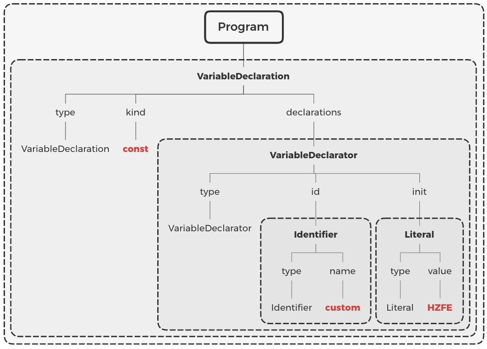
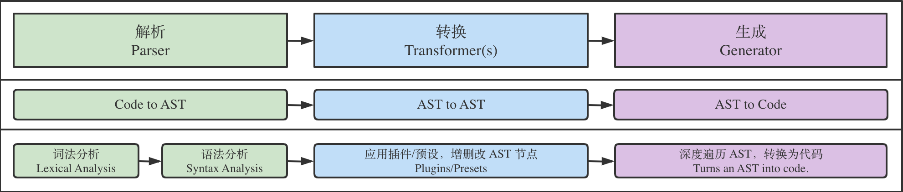

# Babel

Babel 是 JavaScript 编译器：他能让开发者在开发过程中，直接使用各类方言（如 TS、Flow、JSX）或新的语法特性，而不需要考虑运行环境，因为 Babel 可以做到按需转换为低版本支持的代码；Babel 内部原理是将 JS 代码转换为 AST，对 AST 应用各种插件进行处理，最终输出编译后的 JS 代码

## AST 语法抽象树

以树的形式来表现编程语言的语法结构

利用在线 [playground](https://astexplorer.net/) 调试，可以对 AST 有个直观感受：生成的树有多个节点，节点有不同的类型，不同类型节点有不同的属性。

```js
const custom = "HZFE";
```



AST 是源代码的高效表示，能便捷的表示大多数编程语言的结构。适用于做代码分析或转换等需求。之所以用树来进行分析或转换，是因为树能使得程序中的每一节点恰好被访问一次（前序或后序遍历）。

常见使用场景：代码压缩混淆功能可以借助 AST 来实现：分析 AST，基于各种规则进行优化（如 IF 语句优化；移除不可访问代码；移除 debugger 等），从而生成更小的 AST 树，最终输出精简的代码结果。

## Babel 编译流程



1. 解析阶段：Babel 默认使用 @babel/parser 将代码转换为 AST。解析一般分为两个阶段：词法分析和语法分析。
   词法分析：对输入的字符序列做标记化(tokenization)操作。
   语法分析：处理标记与标记之间的关系，最终形成一颗完整的 AST 结构。
2. 转换阶段：Babel 使用 @babel/traverse 提供的方法对 AST 进行深度优先遍历，调用插件对关注节点的处理函数，按需对 AST 节点进行增删改操作。
3. 生成阶段：Babel 默认使用 @babel/generator 将上一阶段处理后的 AST 转换为代码字符串。

## Babel 插件系统 ​

Babel 的核心模块 @babel/core，@babel/parser，@babel/traverse 和 @babel/generator 提供了完整的编译流程。而具体的转换逻辑需要插件来完成。

在使用 Babel 时，我们可通过配置文件指定 plugin 和 preset。而 preset 可以是 plugin 和 preset 以及其他配置的集合。Babel 会递归读取 preset，最终获取一个大的 plugins 数组，用于后续使用。

常见 presets​

- @babel/preset-env
- @babel/preset-typescript
- @babel/preset-react
- @babel/preset-flow

最常见的 @babel/preset-env 预设，包含了一组最新浏览器已支持的 ES 语法特性，并且可以通过配置目标运行环境范围，自动按需引入插件。

### 编写 Babel 插件 ​

Babel 插件的写法是借助访问者模式（Visitor Pattern）对关注的节点定义处理函数。参考一个简单 Babel 插件例子：

```js
module.exports = function () {
  return {
    pre() {},
    // 在 visitor 下挂载各种感兴趣的节点类型的监听方法
    visitor: {
      /**
       * 对 Identify 类型的节点进行处理
       * @param {NodePath} path
       */
      Identifier(path) {
        path.node.name = path.node.name.toUpperCase();
      },
    },
    post() {},
  };
};
```

使用该 Babel 插件的效果如下：

```js
// input
function hzfe() {}

// .babelrc
{
  "plugins": ["babel-plugin-yourpluginname"]
}

// output
function HZFE() {}
```
