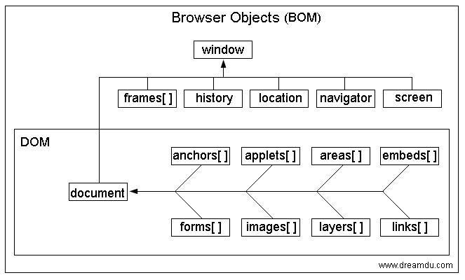

## meta

### viewport
viewport就是设备的屏幕上能用来显示我们的网页的那一块区域，默认的viewport是layout viewport，也就是那个比屏幕要宽的viewport，但在进行移动设备网站的开发时，我们需要的是ideal viewport。
```html
<meta name="viewport"
content="
height = [pixel_value | device-height] ,
width = [pixel_value | device-width ] ,
initial-scale = float_value ,
minimum-scale = float_value ,
maximum-scale = float_value ,
user-scalable = [yes | no] ,
target-densitydpi = [dpi_value | device-dpi | high-dpi | medium-dpi | low-dpi]
"
/>
```
- width=device-width：表示当前的viewpoint等于设备的宽度，width用来设置layout viewport的宽度
- height：用来设置layout viewport的高度
- initial-scale=1.0：表示页面的初始缩放值为1
- maximum-scale：允许用户的最大缩放值
- minimum-scale：允许用户的最小缩放值
- user-scalable：表示是否允许用户缩放，“no”不允许，“yes”允许
- target-densitydpi ：一个屏幕像素密度是由屏幕分辨率决定的，通常定义为每英寸点的数量（dpi）。Android支持三种屏幕像素密度：低像素密度，中像素密度，高像素密度。一个低像素密度的屏幕每英寸上的像素点更少，而一个高像素密度的屏幕每英寸上的像素点更多。Android Browser和WebView默认屏幕为中像素密度。

**例如**
```html
<meta name="viewport" content="width=device-width, initial-scale=1.0, maximum-scale=1.0, user-scalable=0">
```

**关于缩放**
1. 缩放指的是相对于ideal viewport来进行的，比如<meta name="viewport" content="width=500, initial-scale=1">，width=500表示把当前的viewport宽度设为500，initial-scale=1则表示把当前viewport的宽度设为ideal viewport的宽度，浏览器该怎么办呢，一般会取较大的那个值。
2. 不可缩放时，缩放倍率也无效。

### 移动端处理
#### format-detection 超链接
在手机上浏览时，该标签用于指定是否将网页内容中的手机号码显示为拨号的超链接。 
在 iPhone 上默认值是：
```html
<meta name="format-detection" content="telephone=yes"/>
```

#### app-capable 工具栏
这apple-mobile-web-app-capable的作用就是删除默认的苹果工具栏和菜单栏。content有两个值”yes”和”no”,当我们需要显示工具栏和菜单栏时，这个行meta就不用加了，默认就是显示。
```html
<meta name=”apple-mobile-web-app-capable” content=”yes” />
```

#### status-bar 状态栏
作用是控制状态栏显示样式:
```html
<meta name=”apple-mobile-web-app-status-bar-style” content=”default” />
<meta name=”apple-mobile-web-app-status-bar-style” content=”black” />
<meta name=”apple-mobile-web-app-status-bar-style” content=”black-translucent” />
```
default:默认； black:纯黑； black-translucent：半透明灰色

## 加载Dom

DOM完整的解析过程：

1. 解析HTML结构
2. 加载外部脚本和样式表文件
3. 解析并执行脚本代码。//js之类的
4. DOM树构建完成(`DOMContentLoaded`)
5. 加载图片等外部资源文件
6. 页面加载完毕(`window.onload`)

### window.onload 和 DOMContentLoaded 的区别
1、当 onload事件触发时，页面上所有的DOM，样式表，脚本，图片，flash都已经加载完成了。
2、当 DOMContentLoaded 事件触发时，仅当DOM加载完成，不包括样式表，图片，flash。

开发中我们经常需要给一些元素的事件绑定处理函数。但问题是，如果那个元素还没有加载到页面上，但是绑定事件已经执行完了，是没有效果的。这两个事件大致就是用来避免这样一种情况，将绑定的函数放在这两个事件的回调中，保证能在页面的某些元素加载完毕之后再绑定事件的函数。
当然DOMContentLoaded机制更加合理，因为我们可以容忍图片，flash延迟加载，却不可以容忍看见内容后页面不可交互。

## 对象

### window
1 .窗口自身
2 .window.self 引用本窗口
3 .window.name 窗口命名
4 .window.defaultStatus 设定窗口状态栏信息
5 .window.location URL地址，配备布置这个属性可以打开新的页面
6 .window对象是相对于web浏览器而言的，他并不是语言的定义的内置对象，window对象在程序执行前就已经存在了。window对象是宿主在浏览器的情况下才会产生，而global对象是在任何环境中都存在的
7 .window对象具体也就是指浏览器打开的那个窗口
8 .如果html文档包含框架，浏览器会为html文档创建一个window对象，并为每一个框架创建一个额外的对象

#### 方法
1 .window.alert()
2 .window.confirm()
3 .window.prompt()
4 .window.setInterval()
5 .window.clearInterval()
6 .window.setTimeout()
7 .window.open()
8 .window.close()

#### 成员对象
1 .window.event //为什么是undefined
2 .window.document
3 .window.history
4 .window.screen
5 .window.navigator
6 .window.external

#### window.screen
1 .s.width
2 .s.height
3 .s.colorDepth 屏幕色深
4 .s.availWidth 可用宽度
5 .s.availHeight 可用高度

#### window.external
1 .window.external.AddFavorite("地址"，"标题")
2 .把网站新增到保藏夹

#### window.navigator
1 .n.appCodeName //浏览器代码名
2 .n.appName 
3 .n.appMinorVersion 浏览器补丁版本
4 .n.cpuClass cpu类型
5 .n.platform 操作系统类型
6 .n.plugins 浏览器插件
7 .n.opsProfile 
8 .n.userProfile
9 .n.systemlangaguage 客户体系语言
10 .n.userLanguage 用户语言
11 .n.appVersion 浏览器版本
12 .n.userAgent
13 .n.onLine 用户是否在线
14 .n.cookieEnabled 浏览器是否支持cookie
15 .n.mimeTypes

### ducument

1 .document对象是window对象的一个属性(`window.document`)，是显示窗口的一个文档。
2 .document可以理解为文档，就是网页，window是窗口，就是浏览器包含的，在没有框架的情况下是等同的
3 .代表整个HTMl文档，可用来访问页面的所有元素

#### 属性
1 .document.title
2 .document.bgColor
3 .document.fgColor
4 .document.linkColor
5 .document.alinkColor
6 .document.vlinkColor
7 .document.URL 设置url属性从而在同一窗口打开另一网页
8 .document.fileCreateDate 文件建立日期
9 .document.fileModifiedDate 文件修改日期
10 .document.fileSize 
11 .document.cookie
12 .document.charset
13 .document.body
14 .document.location

#### 方法
1 .document.write()动态向页面写内容
2 .document.createelement
3 .document.getElementById
4 .document.getElementByName
5 .document.appendChild

### global
1 .是一个特殊的对象，称为全局对象，他极其所有属性都可以在程序的任何地方访问，即全局变量
2 .在顶层js代码中，可以使用this关键字引用全局对象。但通常不必用这种方式引用全局对象，因为全局对象是作用域链的头，
3 .不属于任何其他对象的属性和方法，最终都是他的属性和方法
4 .isNaN,parseInt()一些常见的特殊值，NaN,undefined等都是他的属性，以及一些构造函数Object,Arrray等也是他的方法
5 .首先这个是不存在的对象，无法访问。
6 .所有在全局作用域中定义的属性和函数，都是global对象的属性和方法
7 .全局对象时预定义的对象，作为js全局函数和全局属性的占位符，通过访问全局对象，可以找到其他所有预定义的对象，函数和属性。全局对象不是任何对象的属性，所以他没有名称